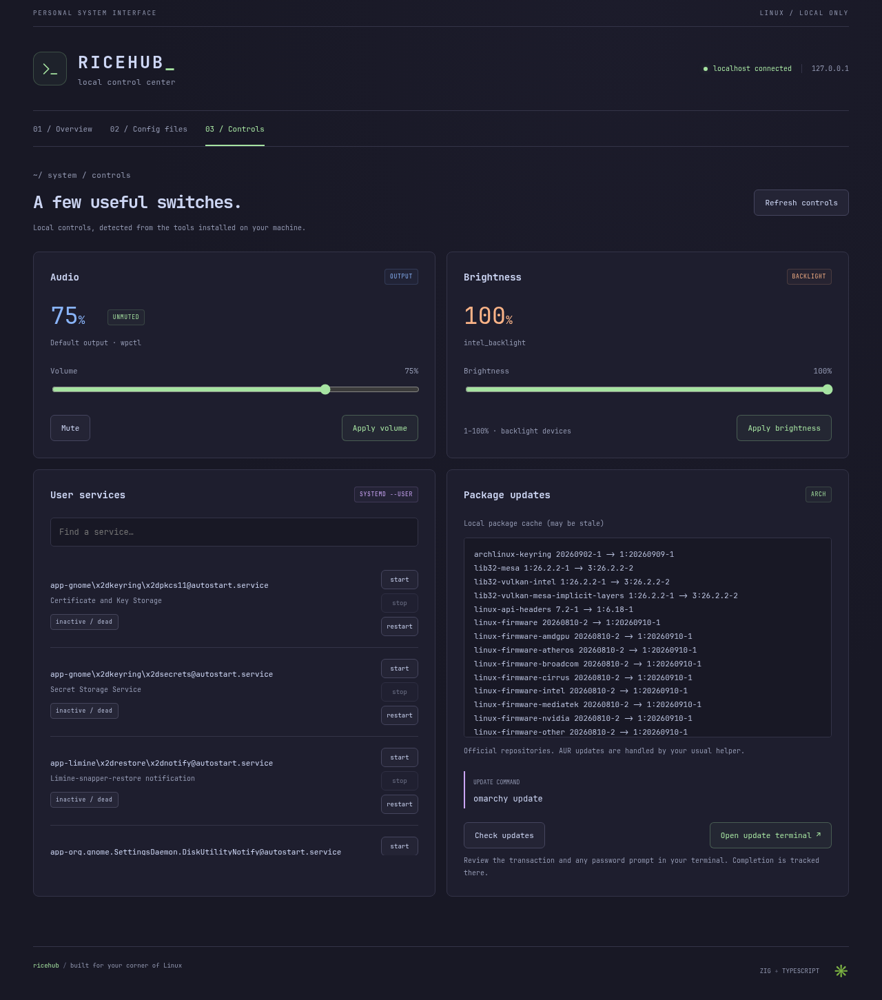
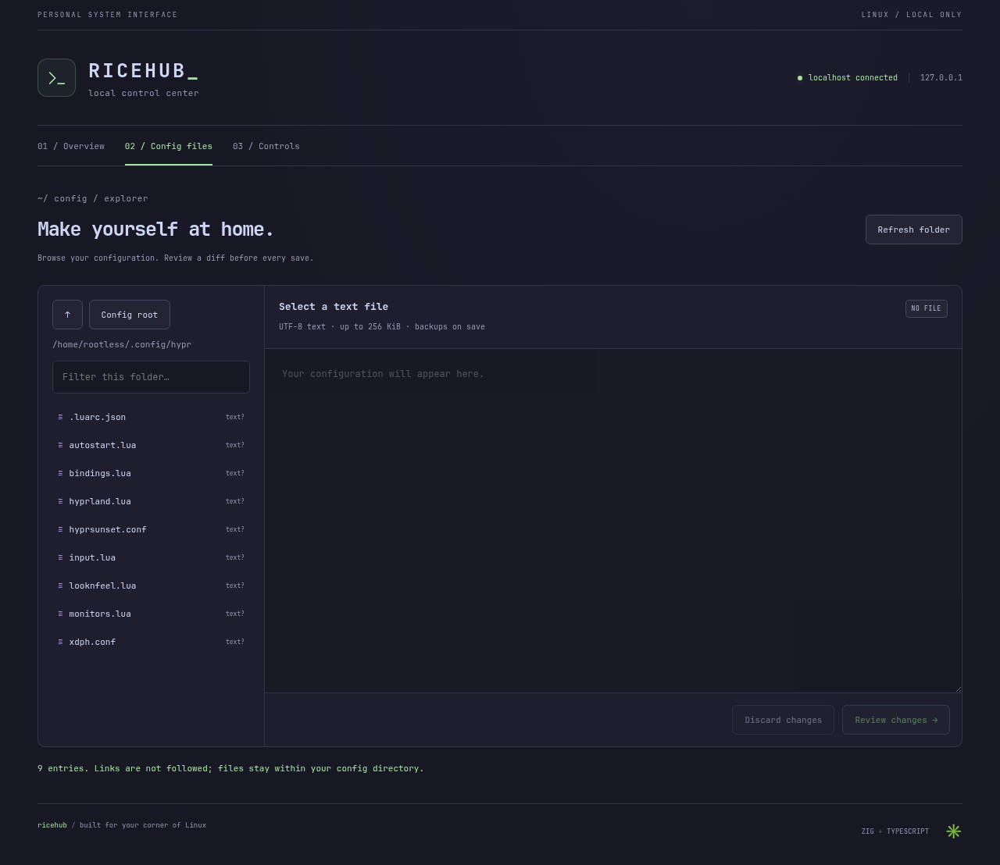
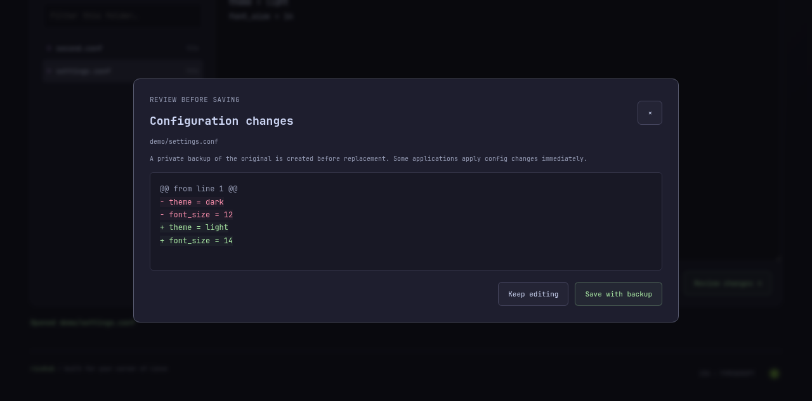

<div align="center">


# RICEHUB

### Your machine. Your rules.

**A fast local Linux control center for your rice — configs, system controls, and more.**

<p>
  <a href="https://github.com/nihitdev/RiceHub/stargazers"></a>
  <a href="https://github.com/nihitdev/RiceHub"></a>
  <a href="https://ziglang.org/"></a>
  <a href="https://www.typescriptlang.org/"></a>
  <a href="https://vite.dev/"></a>
  <a href="LICENSE"></a>
</p>

<p><code>127.0.0.1</code> only · no telemetry · no database · no React</p>

</div>

<br />

RiceHub is a small local web interface for the Linux setup you made your own. It reads real host data, discovers `~/.config`, lets you review config diffs before saving, and exposes useful desktop controls without requiring a specific distribution or window manager.

## What it does

| Overview | Config files | Controls |
| --- | --- | --- |
| OS, kernel, CPU, memory, uptime, shell, session | Browse, filter, read, edit, diff, backup, atomic save | Audio, brightness, user services, package updates |
| Live `/proc` and environment data | SHA-256 stale-edit protection | Hyprland reload when available |

## See it

<table>
<tr>
<td width="50%"></td>
<td width="50%"></td>
</tr>
<tr>
<td align="center"><sub>System controls</sub></td>
<td align="center"><sub>Config browser</sub></td>
</tr>
</table>

<p align="center"></p>

<p align="center"><sub>Review every change before it reaches your configuration.</sub></p>

## Project website

The static project website lives in [`site/`](site/). Preview it locally with:

```sh
python3 -m http.server 4174 --directory site
```

It can be published directly as a static site and has no additional build step.

## Why it feels fast

- A Zig backend with direct Linux file reads and bounded standard-library commands.
- A plain TypeScript/Vite frontend with no UI framework or runtime dependency.
- Each card loads independently, so one missing tool never blanks the page.
- The service listens on loopback by default: `127.0.0.1:7070`.

## Config browser and editor

RiceHub starts at `$XDG_CONFIG_HOME` when absolute, otherwise `$HOME/.config`. Set `RICEHUB_DOTFILES` for another absolute directory; a Git repository is optional.

The editor accepts existing UTF-8 text files up to 256 KiB. Before a save it:

1. Shows a readable diff.
2. Checks the file's SHA-256 revision to catch stale edits.
3. Writes a private `0600` backup beside the file.
4. Preserves POSIX mode bits and atomically replaces the file.

Absolute paths, `..`, symlinks, special files, binary data, oversized files, read-only files, and RiceHub backup files are rejected. Config operations stay beneath the selected root and never invoke a shell.

## Controls

The Controls view detects what your machine supports and explains what is unavailable:

- `wpctl` or `pactl` for default-output volume and mute.
- `brightnessctl` for backlight brightness.
- `systemctl --user` for user service state and confirmed start/stop/restart jobs.
- `pacman`/`checkupdates`, `apt`, or `dnf` for package listings.
- `xdg-terminal-exec` to open an interactive update command for your review.
- `hyprctl reload` when a Hyprland session is detected.

Package updates are never silently applied. Passwords stay in your terminal, and RiceHub reports the terminal launch rather than pretending it completed the transaction.

## Architecture

```text
┌──────────────────────────────────────┐
│ TypeScript + Vite + plain CSS         │
│ Overview · Config files · Controls   │
└──────────────────┬───────────────────┘
                   │ same-origin /api proxy
┌──────────────────▼───────────────────┐
│ Zig 0.16 HTTP service                 │
│ /proc · os-release · environment     │
│ confined config I/O · fixed commands │
└──────────────────────────────────────┘
             127.0.0.1 only
```

`backend/src/system.zig` reads Linux status files. `config.zig` handles confined directory and file operations. `controls.zig` owns optional audio, brightness, services, and package integrations. `api.zig` validates hosts, origins, methods, action headers, JSON bodies, and routes. The frontend modules mirror those boundaries: `main.ts`, `config-browser.ts`, `controls.ts`, and `api.ts`.

## Supported environments

RiceHub targets Linux with `/proc` and an os-release file. It is particularly at home on Arch, Omarchy, Hyprland, and Wayland, but status cards work across Linux desktop environments and window managers.

Required: Zig 0.16.0, Node.js 20.19+ or 22.12+, npm. Python 3 is required only for the test suite. Optional integrations use Git, `hyprctl`, `wpctl`/`pactl`, `brightnessctl`, `systemctl`, `pacman`/`apt`/`dnf`, `checkupdates`, and `xdg-terminal-exec`.

## Install

```sh
git clone https://github.com/nihitdev/RiceHub.git
cd RiceHub/frontend
npm ci
```

## Quick start

```sh
# terminal 1
cd backend
zig build run

# terminal 2
cd frontend
npm run dev
```

Open <http://127.0.0.1:5173>. The API is at <http://127.0.0.1:7070>.

To start both from the project root:

```sh
./scripts/dev.sh
```

Use `RICEHUB_DOTFILES=/absolute/path ./scripts/dev.sh` to select a different config root.

## Development

```sh
cd frontend && npm ci
cd ../backend
zig fmt --check build.zig src
zig build -Doptimize=ReleaseSafe
python3 tests/integration.py
python3 tests/features.py
cd ../frontend && npm run build
```

The tests compare live Linux values and use isolated temporary fixtures for config writes, backups, conflict handling, path confinement, tool fallbacks, service actions, and package controls. They do not change your actual configs, desktop, services, volume, brightness, or packages.

## API

All responses are JSON with `Cache-Control: no-store`. Missing values are `null`; errors include `error_message` and a stable `code` where applicable.

| Method | Endpoint | Purpose |
| --- | --- | --- |
| GET | `/api/system` | OS, kernel, hostname, uptime, shell, desktop/session |
| GET | `/api/memory` | RAM totals in bytes |
| GET | `/api/cpu` | CPU model and logical cores |
| GET | `/api/dotfiles` | Config entries and optional Git metadata |
| POST | `/api/hypr/reload` | Reload a running Hyprland session |
| GET | `/api/config/list?path=...` | List a confined config directory |
| GET | `/api/config/file?path=...` | Read one UTF-8 config file |
| POST | `/api/config/save` | Save `{path, content, revision}` after diff/revision validation |
| GET/POST | `/api/controls/audio` | Read or set volume/mute |
| GET/POST | `/api/controls/brightness` | Read or set backlight percentage |
| GET/POST | `/api/controls/services` | Read or queue a user-service action |
| GET | `/api/controls/updates` | Read cached package updates |
| POST | `/api/controls/updates/check` | Refresh package information |
| POST | `/api/controls/updates/apply` | Open the configured terminal for an update command |

## Security

This is a single-user loopback tool, not a remote administration server. It restricts Host and Origin headers, requires custom action headers, validates JSON and paths, limits file/request sizes, opens config components without following links, uses fixed command arguments, and never accepts arbitrary shell commands. Any local process running as your user can still call the API.

## Project layout

```text
backend/src/       Zig server, Linux readers, config I/O, controls
backend/tests/     Live checks and isolated mutation fixtures
frontend/src/      TypeScript UI, editor, controls, API client, CSS
docs/screenshots/  Verified UI captures used above
scripts/dev.sh     Combined local development runner
```

## Limitations and roadmap

There is no config-language syntax validation, application-specific reload hook, external-monitor DDC support, or authentication beyond loopback validation. Backups preserve content and mode bits but not ACLs or extended attributes. Future work may add syntax-aware checks, process/disk/network cards, package progress, and configurable app reload actions.

## Contributing

Focused issues and pull requests are welcome. Preserve the localhost-only model, keep commands argument-based, add isolated fixture coverage for new actions, and run the full verification commands before submitting changes.

## License

RiceHub is licensed under the [Apache License 2.0](LICENSE). Copyright information is in [NOTICE](NOTICE).
